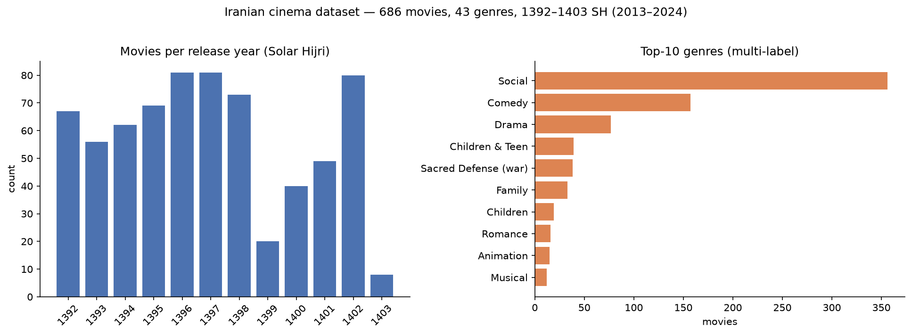

# 🎬 Movie ML Pipeline — Iranian Cinema Analytics & Exact-Genre Recommender

[](https://github.com/Shayan-Amz/Movie-ML-Pipeline/actions/workflows/ci.yml)
[](https://www.python.org/)
[](https://pandas.pydata.org/)
[](https://streamlit.io/)
[](https://github.com/astral-sh/ruff)
[](LICENSE)

An end-to-end data pipeline that **scrapes**, **cleans**, **analyses** and **recommends** Iranian cinema
releases from twelve consecutive box-office seasons — **1392 to 1403 SH (2013 – 2024)**. The result is a
686-film, 43-genre dataset and an interactive **Streamlit** recommender based on *exact multi-genre
fingerprint matching*, ranked by audience rating and by box-office revenue.

<p align="center">
  
</p>

---

## Table of Contents

- [Why this project](#why-this-project)
- [Pipeline architecture](#pipeline-architecture)
- [Dataset](#dataset)
- [Recommendation algorithm](#recommendation-algorithm)
- [Quick start](#quick-start)
- [Repository layout](#repository-layout)
- [Testing & code quality](#testing--code-quality)
- [Design decisions & limitations](#design-decisions--limitations)
- [Roadmap](#roadmap)
- [License](#license)

---

## Why this project

Public data about Iranian cinema is scattered across client-side rendered archive pages with Persian
numerals, inconsistent formatting and multi-valued fields. This project turns that raw HTML into a
tidy, analysis-ready dataset and demonstrates the full life-cycle of a small data product:

| Stage | Skill demonstrated |
| :--- | :--- |
| **Extract** | HTML parsing of a rendered Angular SPA with `BeautifulSoup`, defensive selectors, label-based field lookup for Persian UI strings |
| **Clean** | Missing-value policy, Persian thousands-separator normalisation (`٬`), de-duplication, outlier removal, **multi-label one-hot encoding** |
| **Serve** | A cached Streamlit front-end on top of a pure, unit-tested recommender function |
| **Engineer** | `src/` package layout, CLI entry points, `pytest` suite, `ruff` linting, GitHub Actions CI |

---

## Pipeline architecture

```text
            saved archive pages                 python -m movie_pipeline.extract
   data/raw/1392.html … data/raw/1403.html  ───────────────────────────────────►  data/raw/all_years_movies.csv
                                                 (BeautifulSoup · CSS selectors)      9 columns · 1 row / movie
                                                                                              │
                                                 python -m movie_pipeline.clean               │
                          ┌───────────────────────────────────────────────────────────────────┘
                          ▼
     1. drop columns > 50 % missing            4. drop duplicate rows
     2. strip text, coerce numbers             5. multi-label one-hot encode `genres` → 43 × genre_*
     3. remove ٬ and , thousands separators    6. drop rating == 10 artefacts (5-point scale)
                          │
                          ▼
             data/processed/all_years_movies_cleaned_ohe.csv        686 movies × 52 columns
                          │
                          ▼   streamlit run app/streamlit_app.py
     ┌──────────────────────────────────────────────────────────────────┐
     │  Exact-Genre-Combo Recommender                                   │
     │  pick 3 movies  →  same genre fingerprint  →  🏆 top-k by rating │
     │                                              💰 top-k by sales   │
     └──────────────────────────────────────────────────────────────────┘
```

The same cleaning logic is available in two forms: an exploratory notebook
(`notebooks/02_data_cleaning.ipynb`) whose intermediate outputs can be inspected, and a pure function
(`movie_pipeline.clean.clean_movies`) that is unit-tested and used by the CLI. Both produce a
byte-identical column layout.

---

## Dataset

`data/processed/all_years_movies_cleaned_ohe.csv` — **686 movies × 52 columns**

| Column | Type | Description |
| :--- | :--- | :--- |
| `year` | int | Release year, Solar Hijri (1392 – 1403 ⇢ 2013 – 2024) |
| `title`, `director`, `producer` | str | Persian text as shown in the archive |
| `genres` | str | Comma-separated multi-label genre list (source form) |
| `rating` | float | Audience rating, 1 – 5 scale |
| `viewers` | float | Number of ratings submitted |
| `total_sales` | float | Total box-office revenue (IRR) |
| `actors` | str | Comma-separated principal cast |
| `genre_*` × 43 | 0/1 | One-hot genre indicators, e.g. `genre_اجتماعی` (social), `genre_کمدی` (comedy), `genre_درام` (drama) |

A few facts about the data (from the figure above): *Social* drama dominates the industry (356 of 686
titles), followed by *Comedy* (157) and *Drama* (77); the 1399 (2020) dip reflects the pandemic-era
closure of cinemas; 1403 is a partial season.

> The raw `*.html` pages are not committed (large and site-specific). See
> [`data/raw/README.md`](data/raw/README.md) for how to capture them; the processed dataset **is**
> committed so the app and tests run out of the box.

---

## Recommendation algorithm

Every movie is reduced to a binary **genre signature** — the concatenation of its 43 `genre_*` flags
(e.g. `1-0-0-…-1-0`). Given three reference titles the recommender:

1. collects the signatures of the reference movies;
2. selects every *other* movie whose signature is **identical** to one of them (a single boolean mask);
3. returns two rankings over that candidate set — by `rating` (critical reception) and by
   `total_sales` (commercial success).

```python
from movie_pipeline.recommend import load_movies, recommend_exact_combo

movies = load_movies("data/processed/all_years_movies_cleaned_ohe.csv")
top_rated, top_sales = recommend_exact_combo(["رسوایی", "حوض نقاشی", "پل چوبی"], movies, top_k=5)
```

**Why exact matching?** With 43 genres and 686 films there are only ~100 distinct signatures, so the
approach is O(n), needs no training, and every recommendation is trivially explainable ("same genre
combination as *X*"). Approximate similarity (Jaccard / cosine on the genre vectors) is a natural
extension — see [Roadmap](#roadmap).

---

## Quick start

```bash
git clone https://github.com/Shayan-Amz/Movie-ML-Pipeline.git
cd Movie-ML-Pipeline
python -m venv .venv && source .venv/bin/activate      # Windows: .venv\Scripts\activate
pip install -e ".[app,dev]"                             # package + Streamlit + test tools
```

### Run the recommender app (uses the committed processed dataset)

```bash
streamlit run app/streamlit_app.py
```

### Re-run the pipeline from raw pages

```bash
# 1) put 1392.html … 1403.html in data/raw/  (see data/raw/README.md)
python -m movie_pipeline.extract --html-dir data/raw --out data/raw/all_years_movies.csv
python -m movie_pipeline.clean   --inp data/raw/all_years_movies.csv \
                                 --out data/processed/all_years_movies_cleaned_ohe.csv
```

Both commands accept `--help`.

---

## Repository layout

```text
Movie-ML-Pipeline/
├── app/
│   └── streamlit_app.py          # Streamlit UI (thin layer over movie_pipeline.recommend)
├── src/movie_pipeline/
│   ├── extract.py                # Stage 1 – HTML → raw CSV            (CLI: python -m movie_pipeline.extract)
│   ├── clean.py                  # Stage 2 – raw CSV → cleaned + one-hot (CLI: python -m movie_pipeline.clean)
│   └── recommend.py              # Stage 3 – genre-signature recommender
├── notebooks/
│   └── 02_data_cleaning.ipynb    # exploratory version of stage 2 with inspectable outputs
├── data/
│   ├── raw/                      # <year>.html inputs (git-ignored) + README
│   └── processed/
│       └── all_years_movies_cleaned_ohe.csv
├── tests/                        # pytest suite for all three stages
├── docs/figures/                 # README figures
├── .github/workflows/ci.yml      # ruff + pytest on Python 3.10 and 3.12
├── pyproject.toml                # packaging, dependencies, tool config
├── requirements.txt
└── LICENSE
```

---

## Testing & code quality

```bash
ruff check .      # lint (rules: pyflakes, pycodestyle, isort, bugbear, pyupgrade)
pytest -q         # 14 tests: HTML parsing, cleaning steps, recommender contract, real-dataset smoke test
```

CI runs both on every push and pull request (see the badge at the top).

---

## Design decisions & limitations

- **Saved pages instead of live requests.** The archive is rendered client-side, so a plain HTTP
  request returns an empty shell. Saving fully rendered pages once keeps the pipeline reproducible
  and avoids hammering the site; a Selenium-based fetcher would be the next step for automation.
- **Persian text is preserved as-is.** Titles, names and genre labels are kept in their original
  script so the dataset stays faithful to the source; the README figure maps the top genres to English.
- **Numeric fields are best-effort.** `viewers` (20 % missing) and `total_sales` (11 % missing) are
  `NaN` where the archive shows no value; rankings place missing values last.
- **Rating outliers.** Ratings are 1 – 5, yet a handful of rows carried the value 10; they are removed
  rather than clipped because the origin of the value is unknown.
- **Homonymous titles.** Three titles appear twice (different films, different years); the recommender
  currently treats titles as keys, so those are indistinguishable in the UI.

---

## Roadmap

- [ ] Similarity-based recommendations (Jaccard / cosine over `genre_*`, optionally weighted by director & cast)
- [ ] Selenium fetcher to capture the rendered archive pages automatically
- [ ] Year-over-year analytics page (rating vs. revenue, genre trends) in the Streamlit app
- [ ] English transliteration / translation column for titles and genres

---

## License

Released under the [MIT License](LICENSE). The dataset was compiled from a public box-office archive for
educational and research purposes.
